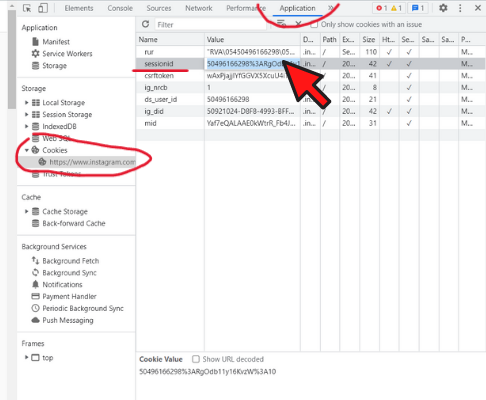

# Instagram Profile Search and ID Lookup

This script allows you to search for an Instagram profile using user ID or retrieve a profile's ID by username. It utilizes the Instagram API to retrieve profile information based on the provided input.

## Prerequisites
- Python 3.x

## Session ID
In order to use this script, you need to provide your Instagram session ID. The session ID is a unique identifier associated with your Instagram login session, and it is required to authenticate your requests to the Instagram API.

To obtain your Instagram session ID, you can follow these steps:

1. Open Instagram in your web browser.
2. Log in to your Instagram account.
3. Right-click on the page and select "Inspect" to open the browser's developer tools.
4. In the developer tools, navigate to the "Application" tab.
5. In the left sidebar, expand the "Cookies" section and select "https://www.instagram.com".
6. Look for a cookie named "sessionid" and copy its value.

## Usage
1. Clone the repository or download the script.
2. Install the required dependencies by running `pip install -r requirements.txt` in your terminal.
3. Run the script by executing `python3 ig-lookup.py --session [SESSION_ID] {--username [USERNAME] OR --userid [USERID]} ` in your terminal.

Please note that the session ID will eventually expire.

## Disclaimer
This script is provided for educational purposes only. Please use it responsibly. Any misuse of this script and its consequences are solely the user's responsibility. The author does not take any responsibility for any misuse of this script.

## License
This project is licensed under the [Creative Commons Attribution-NonCommercial 4.0 International (CC BY-NC 4.0) License](LICENSE.md).

## Author
- [@AyalX](https://github.com/AyalX) on GitHub.

## Contributions
Contributions, issues, and feature requests are welcome. Feel free to check [issues page](https://github.com/AyalX/Instagram-Lookup/issues) if you want to contribute.

## Show your support
Give a ⭐️ if this project helped you!
